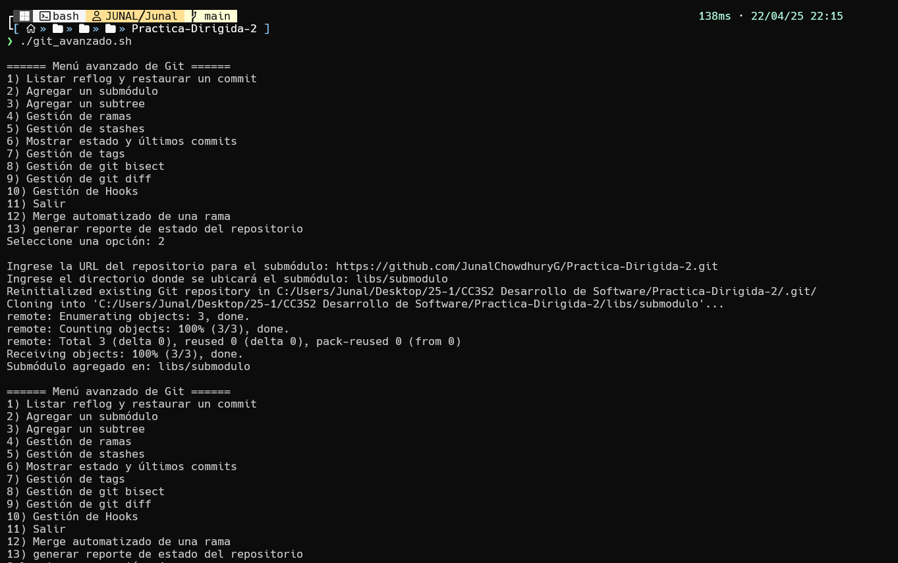
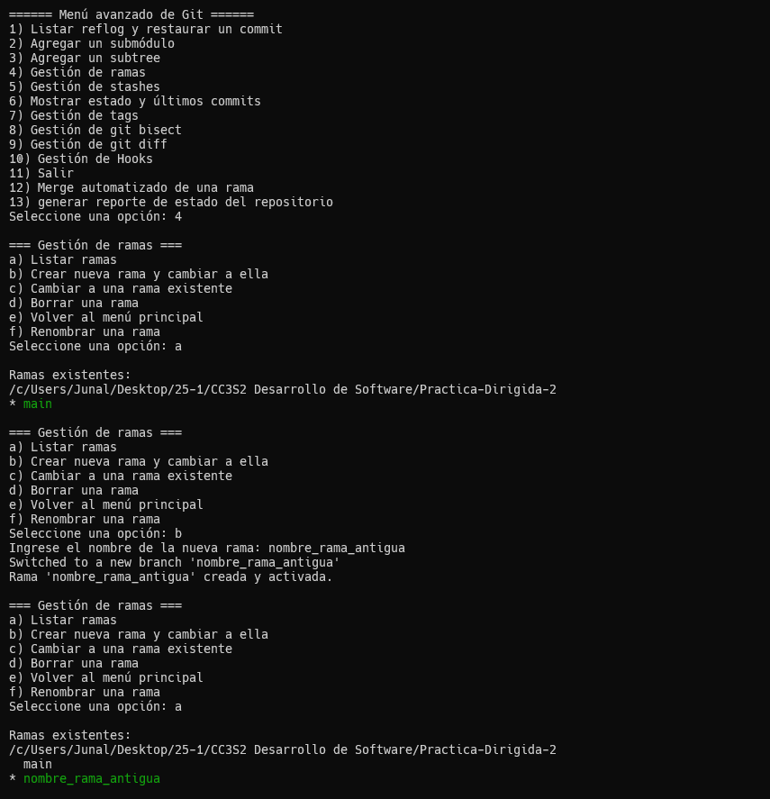
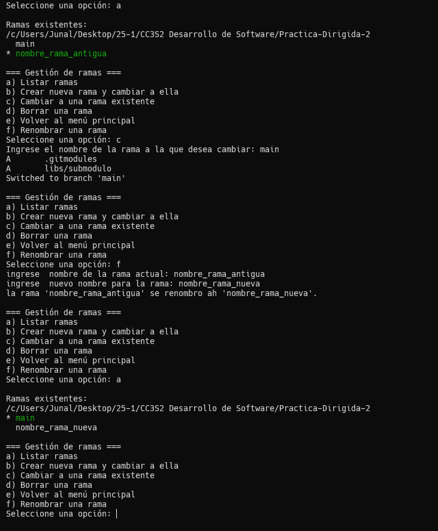
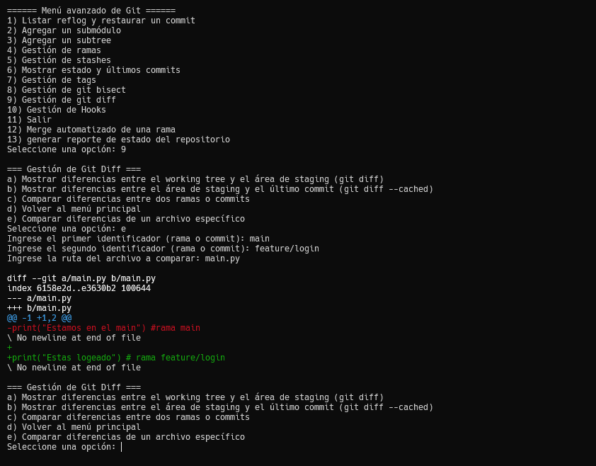
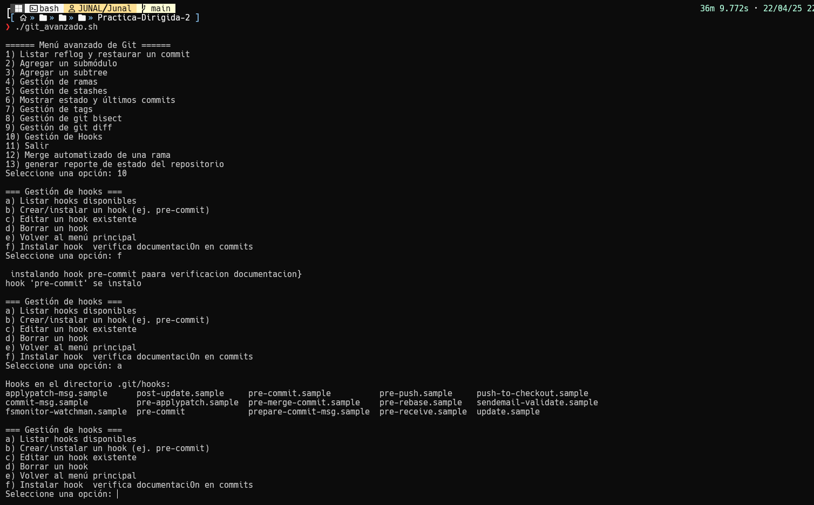
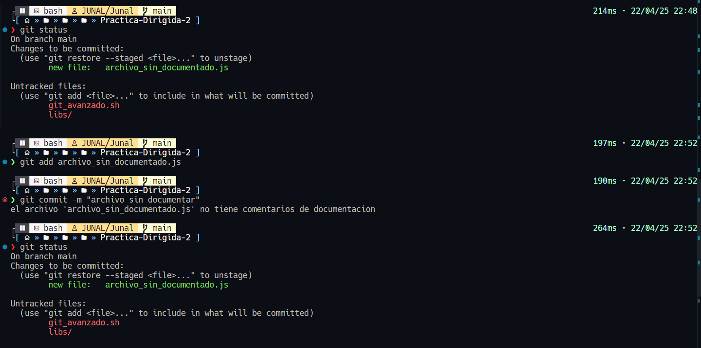
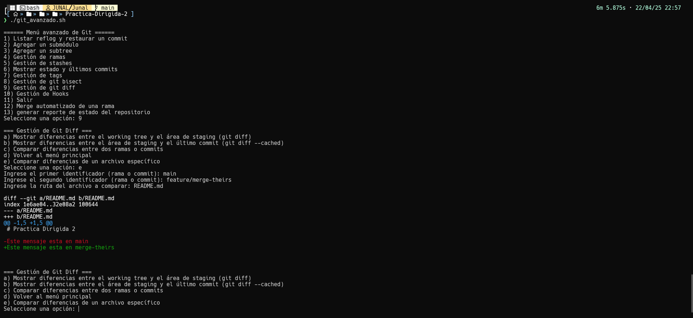
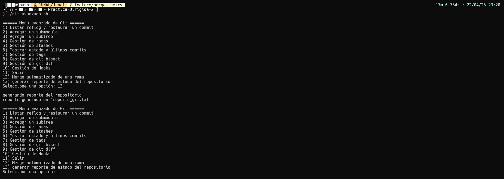

# **Practica Dirigida 2**
`Chowdhury Gomez Junal`
## **Registro y configuracion**


## **Ejercicio 1: Funcionalidad de renombrar ramas**

- Se implemento la funcionalidad `f) Renombrar una rama` en la opcion `4) Gestión de ramas`

```bash
f|F)
    echo -n "ingrese  nombre de la rama actual: "
    read rama_actual
    echo -n "ingrese  nuevo nombre para la rama: "
    read nuevo_nombre
    git branch -m "$rama_actual" "$nuevo_nombre"
    echo "la rama '$rama_actual' se renombro ah '$nuevo_nombre'."
    ;;
```
- Creamos una rama de prueba


- Procedemos a renombrar la rama `nombre_rama_antigua` por `nombre_rama_nueva`


## **Ejercicio 2: Gestión de git diff**
- Hacemos 2 commits en diferentes ramas sobre el mismo archivo `main.py`

- Verificamos que se muestran las diferencias entre ramas

## **Ejercicio 3: Instalar automáticamente un hook**
- creamos la funcion `instalar_hook_documentacion` para verificar si los archivos a commitiar estan comentados
```bash
# funcion intalar hook
function instalar_hook_documentacion() {
    echo ""
    echo " instalando hook pre-commit paara verificacion documentacion"
    hook_path=".git/hooks/pre-commit"
    cat << 'EOF' > "$hook_path"
#!/bin/bash
# Hook pre-commit para verificar documentación en funciones

files=$(git diff --cached --name-only --diff-filter=ACM | grep -E '\.c$|\.h$|\.js$')

for file in $files; do
    if [ -f "$file" ]; then
        if ! grep -q "//" "$file"; then
            echo "el archivo '$file' no tiene comentarios de documentacion"
            exit 1
        fi
    fi
done

exit 0
EOF

    chmod +x "$hook_path"
    echo "hook 'pre-commit' se instalo"
}
```
- Verificamos que se instalo correctamente


- Verificamos que el hook no permite hacer commits archivos sin comentaris


## **Ejercicio 4: merge automatico**
Implemetntamos la funcion `merge_automatizado`: 
```bash
function merge_automatizado() {
    echo ""
    echo "merge automatico para  resolucion de conflictos en ramas"
    echo -n "ingrese  nombre de la rama a fusionar en la rama actual: "
    read rama_a_fusionar

    # verifica si existe rama
    if ! git rev-parse --verify "$rama_a_fusionar" >/dev/null 2>&1; then
        echo "la rama '$rama_a_fusionar' no existe"
        return 1
    fi

    # merge automatico
    echo ""
    echo "realizando merge con estrategia automatico con -X theirs"
    if git merge -X theirs "$rama_a_fusionar"; then
        echo "merge completado utilizando  'theirs'"
    else
        echo "hay conflictos que no se pueden  resolverse automaticamente"
    fi

    echo ""
    echo "estado del repositorio post-merge"
    git status
}
```

- Preparamos el conflicto

- procedemos hacer el merge automatizado


## **Ejercicio 5: generar un reporte**
Implemetntamos la funcion `generar_reporte_git`: 
```bash
function generar_reporte_git() {
    echo ""
    echo "generando reporte del repositorio"
    archivo_reporte="reporte_git.txt"

    {
        echo "REPORTE DEL REPOSITORIO "
        echo ""
        echo "=== Estado del repositorio ==="
        git status
        echo ""
        echo "=== Ramas existentes ==="
        git branch
        echo ""
        echo "=== Últimos 5 commits ==="
        git log --oneline -n 5
        echo ""
        echo "=== Lista de stashes ==="
        git stash list
        echo ""
        echo " FIN DEL REPORTE"
    } > "$archivo_reporte"

    echo "reporte generado en '$archivo_reporte'"
}
```

- El reporte saldra parecido a esto:
```
REPORTE DEL REPOSITORIO 

=== Estado del repositorio ===
On branch feature/merge-theirs
Changes not staged for commit:
  (use "git add <file>..." to update what will be committed)
  (use "git restore <file>..." to discard changes in working directory)
	modified:   git_avanzado.sh

Untracked files:
  (use "git add <file>..." to include in what will be committed)
	reporte_git.txt

no changes added to commit (use "git add" and/or "git commit -a")

=== Ramas existentes ===
  feature/login
* feature/merge-theirs
  main
  nombre_rama_nueva

=== Últimos 5 commits ===
2f87c74 Merge branch 'main' into feature/merge-theirs
4b956d3 add .
cd70fd4 add .
f8cdef3 commit readme en feature/merge-theirs
7a32bf3 commit readme en main

=== Lista de stashes ===

 FIN DEL REPORTE

```
